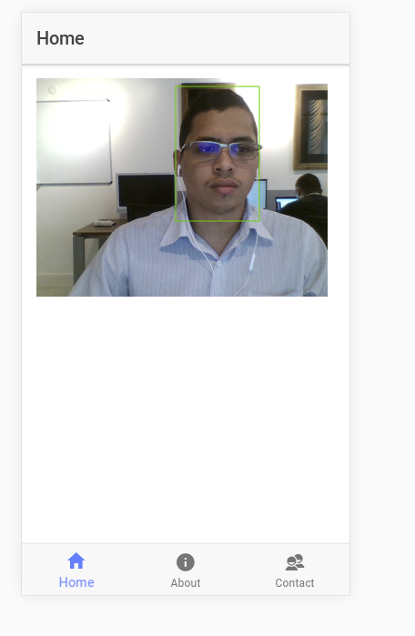

# Sample: Face Detection with Ionic

Ionic 2 with face detection sample - in working.



## Getting Started

```
npm i
```
```
ionic serve
```
## Built With

* [headtrackr](https://github.com/auduno/headtrackr) - avascript library for real-time face tracking and head tracking
* [cordova-plugin-webrtc](https://github.com/remotium/cordova-plugin-webrtc) - webRTC capabilities 

